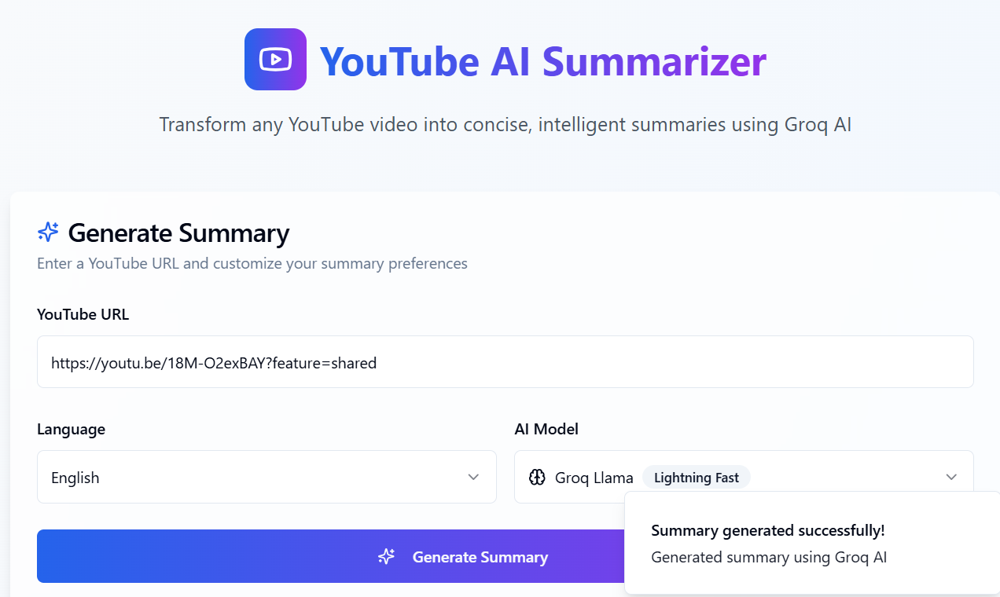
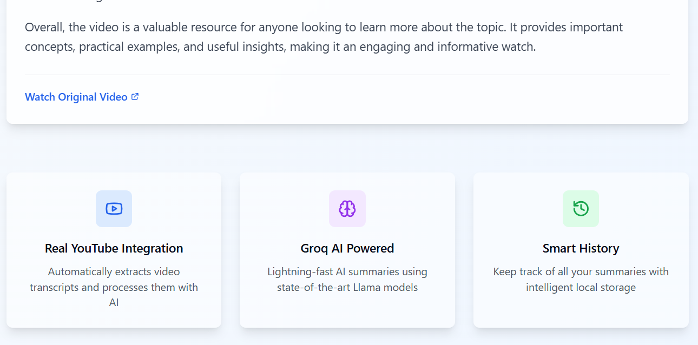
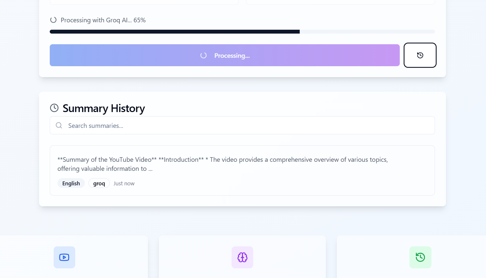
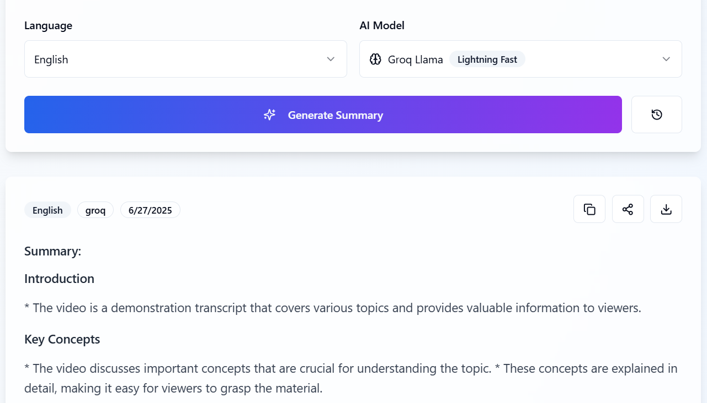

# 🎥 AI-Powered YouTube Summarizer

A modern web application that transforms YouTube videos into concise, intelligent summaries using Groq AI. Built with React, TypeScript, and Supabase for learning API integration concepts.

---

## 🖼️ App UI Previews

### 🔗 Enter YouTube Video URL



### ⚙️ Features Panel



### 🧠 Generate Summary



### 📜 Summary History Panel



---

## 🚀 Features

- **Real YouTube Integration**: Automatically extracts video transcripts
- **AI-Powered Summaries**: Uses Groq's Lightning-fast Llama models
- **Multi-language Support**: English and German summaries
- **Progress Tracking**: Real-time progress updates during processing
- **History Management**: Keep track of all your summaries
- **Responsive Design**: Works perfectly on all devices
- **Secure API Integration**: Environment variables for API keys

---

## 🛠️ Tech Stack

- **Frontend**: React 18, TypeScript, Vite
- **Styling**: Tailwind CSS, Shadcn/ui components
- **Backend**: Supabase Edge Functions
- **AI**: Groq API (Llama 3 8B model)
- **Database**: Supabase PostgreSQL
- **State Management**: React Query (TanStack Query)

---

## 📁 Project Structure

```
ai-youtube-summarizer/
├── public/
│   ├── favicon.ico
│   └── placeholder.svg
├── src/
│   ├── components/
│   │   ├── ui/
│   │   ├── HistoryPanel.tsx
│   │   └── SummaryCard.tsx
│   ├── hooks/
│   │   ├── use-mobile.tsx
│   │   └── use-toast.ts
│   ├── integrations/
│   │   └── supabase/
│   │       ├── client.ts
│   │       └── types.ts
│   ├── lib/
│   │   └── utils.ts
│   ├── pages/
│   │   ├── Index.tsx
│   │   └── NotFound.tsx
│   ├── App.tsx
│   ├── main.tsx
│   └── index.css
├── supabase/
│   ├── functions/
│   │   └── summarize-video/
│   │       └── index.ts
│   └── config.toml
├── package.json
├── tailwind.config.ts
├── tsconfig.json
├── vite.config.ts
└── README.md
```

---

## 🚀 Getting Started

### Prerequisites

- Node.js 18+ and npm
- Supabase account
- Groq API key

### Installation

1. **Clone the repository**

   ```bash
   git clone <your-repo-url>
   cd ai-youtube-summarizer
   ```

2. **Install dependencies**

   ```bash
   npm install
   ```

3. **Set up Supabase**

   - Create a new Supabase project
   - Copy your project URL and anon key
   - Update `src/integrations/supabase/client.ts` with your credentials

4. **Configure environment variables**
   In your Supabase project dashboard:

   - Go to Project Settings → Edge Functions → Environment Variables
   - Add `GROQ_API_KEY` with your Groq API key

5. **Deploy Edge Functions**

   ```bash
   npx supabase functions deploy summarize-video
   ```

6. **Start the development server**
   ```bash
   npm run dev
   ```

---

## 🔧 Configuration

### Supabase Setup

1. Create a new Supabase project at [supabase.com](https://supabase.com)
2. Get your project URL and anon key from Project Settings → API
3. Update the client configuration in `src/integrations/supabase/client.ts`

### Groq API Setup

1. Get your API key from [Groq Console](https://console.groq.com)
2. Add it to your Supabase Edge Functions environment variables
3. The app uses the `llama3-8b-8192` model for fast processing

---

## 🎯 API Integration Learning Points

### 1. HTTP Requests & Async Operations

```ts
const { data, error } = await supabase.functions.invoke("summarize-video", {
  body: { videoUrl, language, model },
});
```

### 2. Error Handling

```ts
try {
  // API call
} catch (error) {
  toast({
    title: "Error generating summary",
    description: error.message,
    variant: "destructive",
  });
}
```

### 3. Progress Tracking

```ts
const progressInterval = setInterval(() => {
  setProgress((prev) => prev + Math.random() * 15);
}, 800);
```

### 4. Environment Variables

```ts
const groqApiKey = Deno.env.get("GROQ_API_KEY");
```

---

## 🔒 Security

- API keys are stored securely in Supabase Edge Functions
- CORS headers properly configured
- Input validation on all user inputs
- No sensitive data exposed to frontend

---

## 🚀 Deployment

### Deploy to Vercel/Netlify

1. Build the project:
   ```bash
   npm run build
   ```
2. Deploy the `dist` folder to your preferred hosting platform

### Deploy Edge Functions

```bash
npx supabase functions deploy summarize-video
```

---

## 🤝 Contributing

1. Fork the repository
2. Create a feature branch: `git checkout -b feature-name`
3. Commit changes: `git commit -am 'Add feature'`
4. Push to branch: `git push origin feature-name`
5. Submit a pull request

---

## 📝 License

This project is open source and available under the [MIT License](LICENSE).

---

## 🔗 Links

- [Groq API Documentation](https://console.groq.com/docs/quickstart)
- [Supabase Documentation](https://supabase.com/docs)
- [React Documentation](https://react.dev)
- [Tailwind CSS](https://tailwindcss.com)

---

## 🙋‍♀️ Support

If you have any questions or run into issues, feel free to open an issue in the repository.

---

Built with ❤️ by Pallavi R S for learning modern web API integration.
